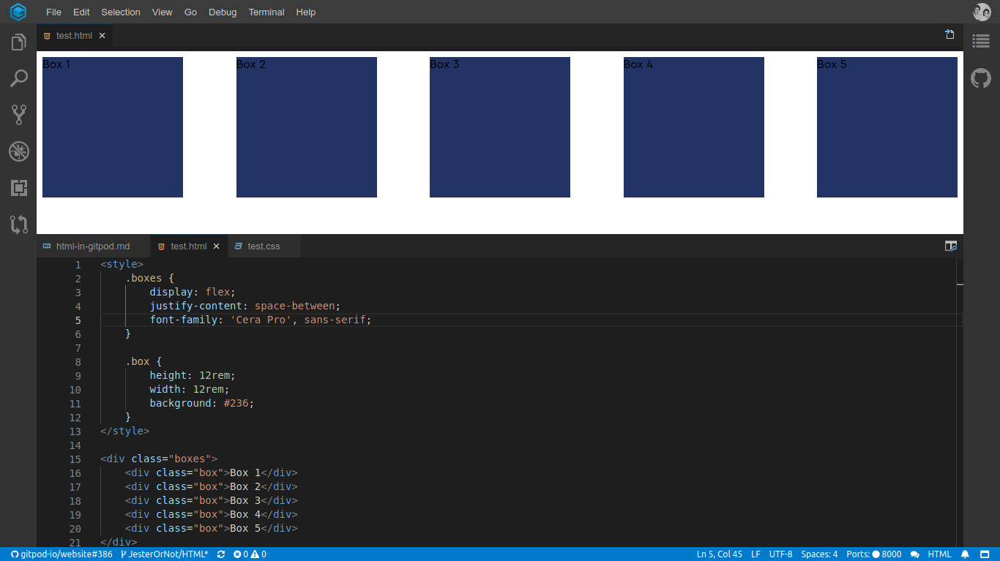

# HTML

Looking to try web development in Gitpod? Well you're in luck: Gitpod was made with web development in mind. And, depending on your needs, you may want to customize this experience further!

## Emmet Support

Gitpod comes with emmet support right out of the box you can open a preview while you are coding in the upper right hand corner  click it see the result in real time!

## Try It!

Want to try it out? And see a minimal example in action? Great, then you can open this in Gitpod:

