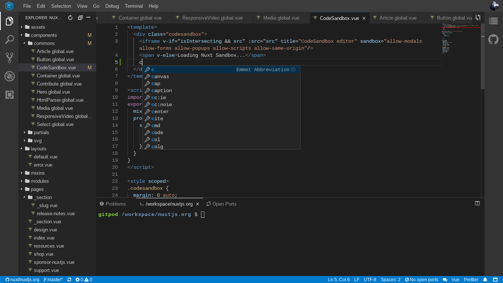

# Vue.js in Gitpod

In order to work with Vue.js in Gitpod, you will need to properly configure your repository. Here is how to do it.

## Examples

However, before we begin here are a few example repositories to help give you an idea of what to expect

<div class="table-container">

| Repository | Description | Try it |
|------------|-------------|--------|
|vuepress|Minimalistic Vue-powered static site generator| [](https://gitpod.io/#https://github.com/vuejs/vuepress)|

</div>

## VSCode Extensions 

### Vetur



Vetur provides syntax highlighting, snippets, Emmet support, lintiing/error checking, auto formatting, and auto-complete for Vue files.

To add this extension to a new repository open the project in Gitpod and in the terminal run `gp init`
it should generate two files a [`.gitpod.yml`](https://www.gitpod.io/docs/config-gitpod-file/) and a [`.gitpod.Dockerfile`](https://www.gitpod.io/docs/config-docker/), in the `.gitpod.yml` file add the following

```yaml
vscode:
  extensions:
    - octref.vetur@0.23.0:TEzauMObB6f3i2JqlvrOpA==
```

For projects that already have a `.gitpod.yml` you can skip the first part and just add the provided snippet.
